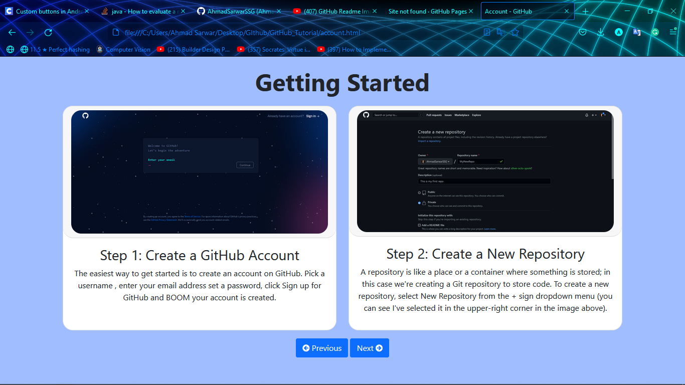

<h2 class="text-center">GitHub Tutorial</h2>
This website will help you in how you can use GitHub? And What are Basic Commands of Github and how can we use thses commands.
<h3 class="text-center">Working Images</h3>

